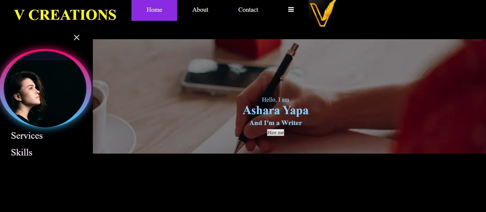

# ashwebhoster.github.io

URL :  https://ashwebhoster.github.io/
Source : https://github.com/ashwebhoster/ashwebhoster.github.io

# Ashara Yapa's Portfolio

Hello! This is the repository for my personal portfolio website where I showcase my work, projects, and a bit about myself.



## Features

- **Responsive Design**: Works smoothly on desktop and other devices.
- **Interactive Projects Showcase**: Hover animations and detailed descriptions for each.
- Added database configuration details (with an sql dump - portfolioweb.sql) 

## Technologies Used

- HTML5
- CSS
- JavaScript
- php
- [Bootstrap 5](https://getbootstrap.com/)

## Local Setup

 **Clone the Repository**:
   
   ```bash
  https://github.com/ashwebhoster/ashwebhoster.github.io

1.Open index.html in a web browser.

 Contributions
This is a personal project and not actively looking for contributors, feedback, suggestions, and bug reports are welcome.

Contact
Feel free to reach out!

GitHub
Email: asharahasarangiyapa1999@gmail.com
Thank you for visiting!


